# Schémas Mermaid - Collector Shop
> Coller chaque bloc ```mermaid dans https://mermaid.live pour générer le visuel

---

## 1. Architecture Globale de l'Application

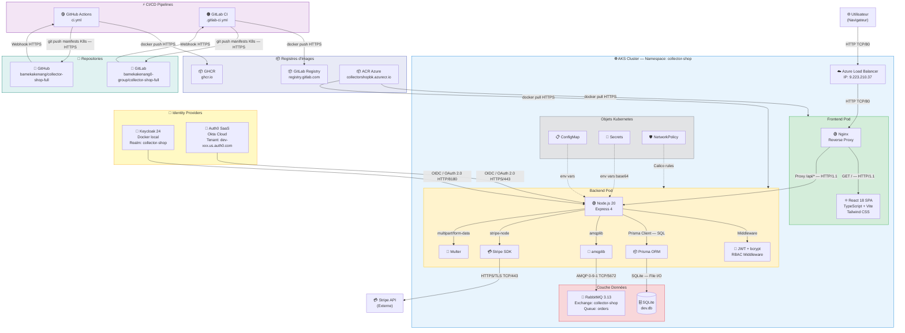

---

## 2. Modèle de Données (Prisma / SQLite)

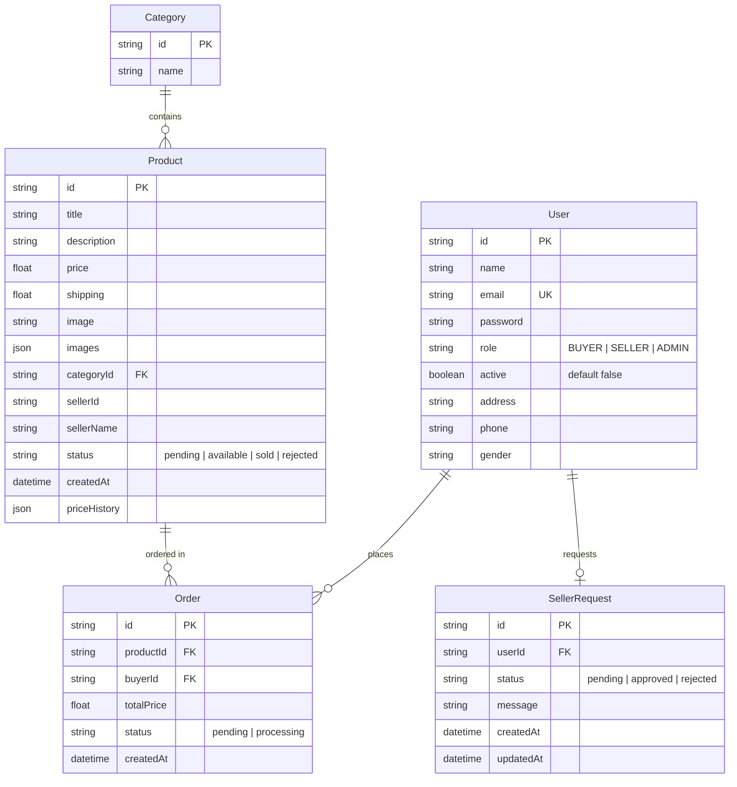

---

## 3. Cycle de Vie Dev(Sec)Ops

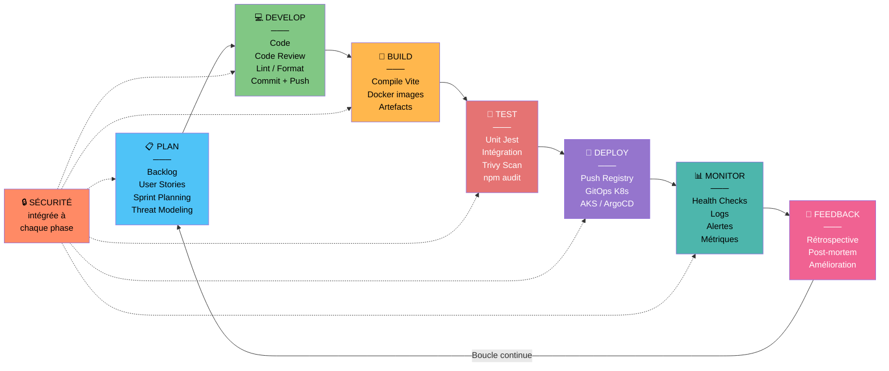

---

## 4. Pipeline CI/CD — GitHub Actions

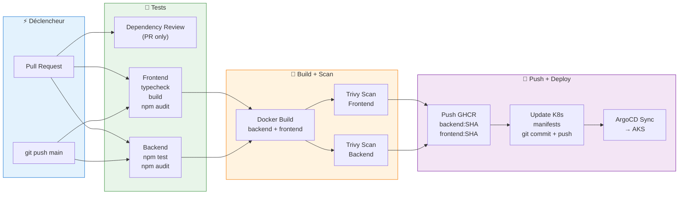

---

## 5. Pipeline CI/CD — GitLab CI

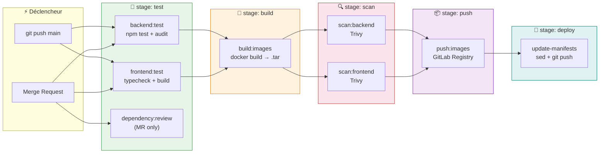

---

## 6. Comparaison GitHub Actions vs GitLab CI

```mermaid
graph TB
    subgraph GHA["GitHub Actions"]
        direction TB
        GHA1["✅ Marketplace 15000+ actions"]
        GHA2["✅ Intégration GitHub native"]
        GHA3["✅ GHCR + Dependabot"]
        GHA4["✅ 2000 min/mois gratuites"]
        GHA5["❌ Pas de DAG natif"]
        GHA6["❌ Artefacts via upload/download"]
        GHA7["⚠️ Max 6h par job"]
    end

    subgraph GLC["GitLab CI"]
        direction TB
        GLC1["✅ Stages séquentiels clairs"]
        GLC2["✅ Registry Docker intégré"]
        GLC3["✅ Review Apps + Auto DevOps"]
        GLC4["✅ Runners self-hosted illimités"]
        GLC5["❌ Marketplace moins riche"]
        GLC6["❌ Docker-in-Docker complexe"]
        GLC7["⚠️ Shared runners lents"]
    end

    REC{{"⚖️ Recommandation :<br/>GitHub Actions<br/>(code déjà sur GitHub,<br/>pipeline fonctionnel)"}}

    GHA --> REC
    GLC --> REC

    style GHA fill:#24292e,color:#fff
    style GLC fill:#fc6d26,color:#fff
    style REC fill:#28a745,color:#fff
```

---

## 7. Architecture Kubernetes — Composants AKS

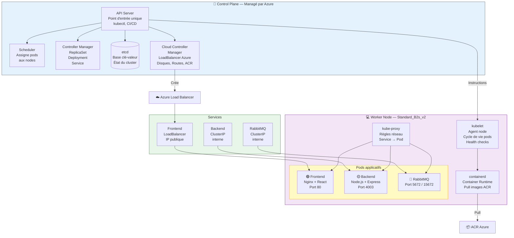

---

## 8. Métiers Impliqués et Interactions

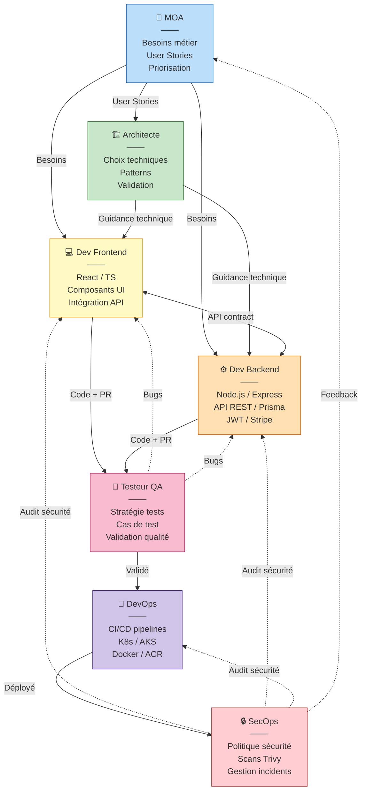

---

## 9. Stratégie de Tests dans le Pipeline

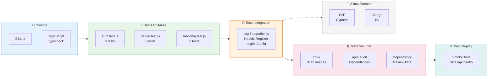

---

## 10. Analyse des Risques et Mitigations

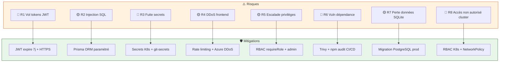

---

## 11. Gestion des Incidents

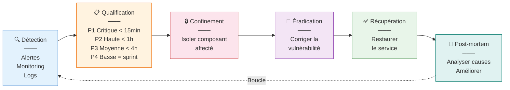

---

## 12. Amélioration Continue Sécurité

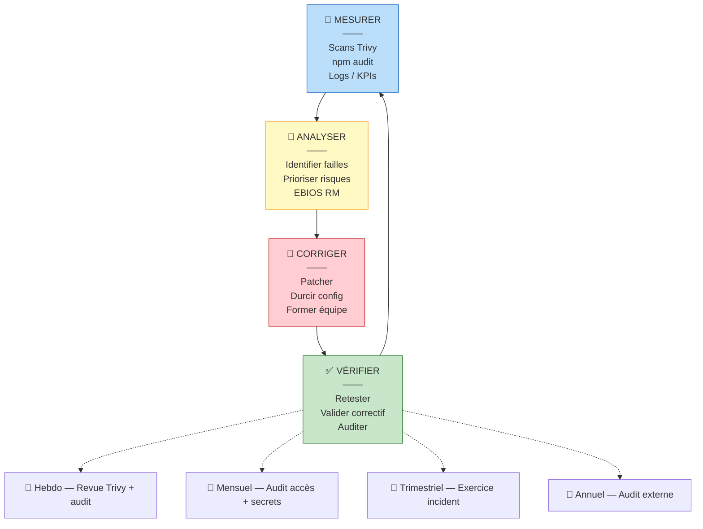

---

## 13. Flux de Communication (Sequence)

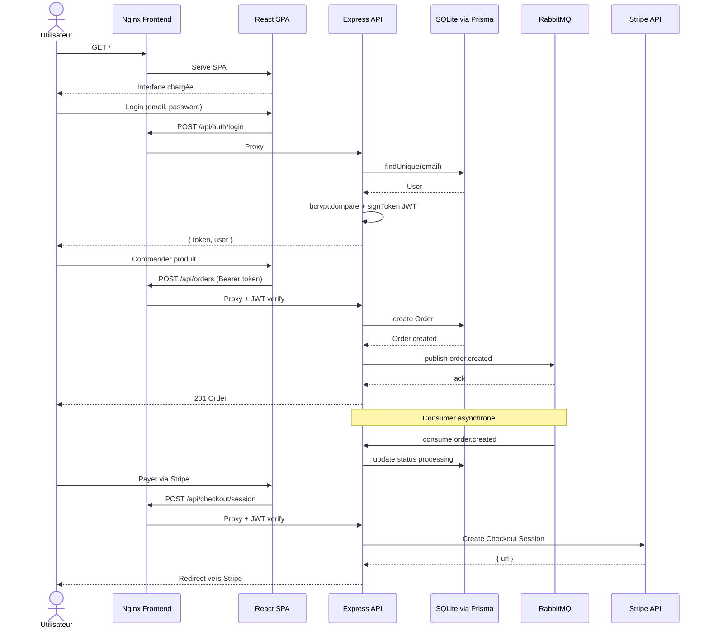

---

## 14. Comparaison Keycloak vs Auth0

```mermaid
graph TB
    subgraph KC["🔑 Keycloak"]
        direction TB
        KC1["✅ Open-source gratuit"]
        KC2["✅ Auto-hébergé souveraineté"]
        KC3["✅ RGPD données locales"]
        KC4["✅ Pas de limite utilisateurs"]
        KC5["✅ LDAP / AD / Kerberos"]
        KC6["❌ Infrastructure à gérer"]
        KC7["❌ Maintenance mises à jour"]
        KC8["⚠️ Démarrage 30-60s"]
    end

    subgraph A0["🔐 Auth0"]
        direction TB
        A01["✅ SaaS zéro infra"]
        A02["✅ Setup en 5 min"]
        A03["✅ SLA 99.99%"]
        A04["✅ SDKs tous langages"]
        A05["✅ MFA / Passwordless"]
        A06["❌ Coût par MAU"]
        A07["❌ Vendor lock-in"]
        A08["⚠️ Données chez Okta"]
    end

    REC2{{"⚖️ Recommandation :<br/>Auth0 pour démarrer<br/>Keycloak si >50K users<br/>ou souveraineté requise"}}

    KC --> REC2
    A0 --> REC2

    style KC fill:#d32f2f,color:#fff
    style A0 fill:#1565c0,color:#fff
    style REC2 fill:#2e7d32,color:#fff
```
