# Schémas Mermaid - Collector Shop
> Coller chaque bloc ```mermaid dans https://mermaid.live pour générer le visuel

---

## 1. Architecture Globale de l'Application

```mermaid
graph TB
    User["🌐 Utilisateur<br/>(Navigateur)"]

    subgraph CI_CD["⚡ CI/CD Pipelines"]
        direction LR
        GHA["🟣 GitHub Actions<br/>ci.yml"]
        GLC["🟠 GitLab CI<br/>.gitlab-ci.yml"]
    end

    subgraph Registries["📦 Registres d'Images"]
        direction LR
        GHCR["📦 GHCR<br/>ghcr.io"]
        GLR["📦 GitLab Registry<br/>registry.gitlab.com"]
        ACR["📦 ACR Azure<br/>collectorshopbk.azurecr.io"]
    end

    subgraph AKS["☸️ AKS Cluster — Namespace: collector-shop"]
        direction TB

        ALB["☁️ Azure Load Balancer<br/>IP: 9.223.210.37"]

        subgraph FrontendPod["Frontend Pod"]
            Nginx["🟢 Nginx<br/>Reverse Proxy"]
            React["⚛️ React 18 SPA<br/>TypeScript + Vite<br/>Tailwind CSS"]
        end

        subgraph BackendPod["Backend Pod"]
            Express["🟢 Node.js 20<br/>Express 4"]
            Auth["🔐 JWT + bcrypt<br/>RBAC Middleware"]
            PrismaC["📦 Prisma ORM"]
            RMQClient["🐰 amqplib"]
            StripeSDK["💳 Stripe SDK"]
            Multer["📸 Multer"]
        end

        subgraph DataPod["Couche Données"]
            SQLite[("🗄️ SQLite<br/>dev.db")]
            RabbitMQ["🐰 RabbitMQ 3.13<br/>Exchange: collector-shop<br/>Queue: orders"]
        end

        subgraph K8sObjects["Objets Kubernetes"]
            CM["📋 ConfigMap"]
            Sec["🔑 Secrets"]
            NP["🛡️ NetworkPolicy"]
        end
    end

    Stripe["💳 Stripe API<br/>(Externe)"]

    subgraph Auth_Providers["🔐 Identity Providers"]
        direction LR
        KC["🔑 Keycloak 24<br/>Docker local<br/>Realm: collector-shop"]
        A0["🔐 Auth0 SaaS<br/>Okta Cloud<br/>Tenant: dev-xxx.us.auth0.com"]
    end

    subgraph Repos["📂 Repositories"]
        direction LR
        GH["🐙 GitHub<br/>bamekakenang/collector-shop-full"]
        GL["🦊 GitLab<br/>bamekakenang0-group/collector-shop-full"]
    end

    User -->|"HTTP TCP/80"| ALB
    ALB -->|"HTTP TCP/80"| Nginx
    Nginx -->|"GET / — HTTP/1.1"| React
    Nginx -->|"Proxy /api/* — HTTP/1.1"| Express

    Express -->|"Middleware"| Auth
    Express -->|"Prisma Client — SQL"| PrismaC
    Express -->|"amqplib"| RMQClient
    Express -->|"stripe-node"| StripeSDK
    Express -->|"multipart/form-data"| Multer
    PrismaC -->|"SQLite — File I/O"| SQLite
    RMQClient -->|"AMQP 0-9-1 TCP/5672"| RabbitMQ
    StripeSDK -->|"HTTPS/TLS TCP/443"| Stripe

    CM -.->|"env vars"| Express
    Sec -.->|"env vars base64"| Express
    NP -.->|"Calico rules"| BackendPod

    GH -->|"Webhook HTTPS"| GHA
    GL -->|"Webhook HTTPS"| GLC
    GHA -->|"docker push HTTPS"| GHCR
    GLC -->|"docker push HTTPS"| GLR
    ACR -->|"docker pull HTTPS"| FrontendPod
    ACR -->|"docker pull HTTPS"| BackendPod

    GHA -->|"git push manifests K8s — HTTPS"| GH
    GLC -->|"git push manifests K8s — HTTPS"| GL

    KC -->|"OIDC / OAuth 2.0 HTTP/8180"| Express
    A0 -->|"OIDC / OAuth 2.0 HTTPS/443"| Express

    style CI_CD fill:#f3e5f5,stroke:#7b1fa2
    style Registries fill:#e8eaf6,stroke:#3f51b5
    style AKS fill:#e8f4fd,stroke:#0078d4
    style FrontendPod fill:#d4edda,stroke:#28a745
    style BackendPod fill:#fff3cd,stroke:#ffc107
    style DataPod fill:#f8d7da,stroke:#dc3545
    style K8sObjects fill:#e2e3e5,stroke:#6c757d
    style Auth_Providers fill:#fff9c4,stroke:#f9a825
    style Repos fill:#e0f2f1,stroke:#00796b
```



---

## 2. Modèle de Données (Prisma / SQLite)


---

## 3. Cycle de Vie Dev(Sec)Ops

```mermaid
graph LR
    PLAN["📋 PLAN<br/>───<br/>Backlog<br/>User Stories<br/>Sprint Planning<br/>Threat Modeling"]
    DEV["💻 DEVELOP<br/>───<br/>Code<br/>Code Review<br/>Lint / Format<br/>Commit + Push"]
    BUILD["🔨 BUILD<br/>───<br/>Compile Vite<br/>Docker images<br/>Artefacts"]
    TEST["🧪 TEST<br/>───<br/>Unit Jest<br/>Intégration<br/>Trivy Scan<br/>npm audit"]
    DEPLOY["🚀 DEPLOY<br/>───<br/>Push Registry<br/>GitOps K8s<br/>AKS / ArgoCD"]
    MONITOR["📊 MONITOR<br/>───<br/>Health Checks<br/>Logs<br/>Alertes<br/>Métriques"]
    FEEDBACK["🔄 FEEDBACK<br/>───<br/>Rétrospective<br/>Post-mortem<br/>Amélioration"]

    PLAN --> DEV --> BUILD --> TEST --> DEPLOY --> MONITOR --> FEEDBACK
    FEEDBACK -->|"Boucle continue"| PLAN

    SEC["🔒 SÉCURITÉ<br/>intégrée à<br/>chaque phase"]
    SEC -.-> PLAN
    SEC -.-> DEV
    SEC -.-> BUILD
    SEC -.-> TEST
    SEC -.-> DEPLOY
    SEC -.-> MONITOR

    style PLAN fill:#4fc3f7,color:#000
    style DEV fill:#81c784,color:#000
    style BUILD fill:#ffb74d,color:#000
    style TEST fill:#e57373,color:#fff
    style DEPLOY fill:#9575cd,color:#fff
    style MONITOR fill:#4db6ac,color:#000
    style FEEDBACK fill:#f06292,color:#fff
    style SEC fill:#ff8a65,color:#000
```



---

## 4. Pipeline CI/CD — GitHub Actions


---

## 5. Pipeline CI/CD — GitLab CI

```mermaid
graph LR
    subgraph Trigger["⚡ Déclencheur"]
        Push["git push main"]
        MR["Merge Request"]
    end

    subgraph S1["🧪 stage: test"]
        BT["backend:test<br/>npm test + audit"]
        FT["frontend:test<br/>typecheck + build"]
        DR["dependency:review<br/>(MR only)"]
    end

    subgraph S2["🔨 stage: build"]
        BI["build:images<br/>docker build → .tar"]
    end

    subgraph S3["🔍 stage: scan"]
        SB["scan:backend<br/>Trivy"]
        SF["scan:frontend<br/>Trivy"]
    end

    subgraph S4["📦 stage: push"]
        PI["push:images<br/>GitLab Registry"]
    end

    subgraph S5["🚀 stage: deploy"]
        UM["update-manifests<br/>sed + git push"]
    end

    Push --> BT & FT
    MR --> BT & FT & DR
    BT & FT --> BI
    BI --> SB & SF
    SB & SF --> PI
    PI --> UM

    style S1 fill:#e8f5e9,stroke:#388e3c
    style S2 fill:#fff3e0,stroke:#f57c00
    style S3 fill:#fce4ec,stroke:#c62828
    style S4 fill:#f3e5f5,stroke:#7b1fa2
    style S5 fill:#e0f2f1,stroke:#00796b
```



---

## 6. Comparaison GitHub Actions vs GitLab CI

```mermaid
graph TB
    subgraph GHA["GitHub Actions"]
        direction TB
        GHA1["✅ Marketplace 15000+ actions"]
        GHA2["✅ Intégration GitHub native"]
        GHA3["✅ GHCR + Dependabot"]
        GHA4["✅ 2000 min/mois gratuites"]
        GHA5["❌ Pas de DAG natif"]
        GHA6["❌ Artefacts via upload/download"]
        GHA7["⚠️ Max 6h par job"]
    end

    subgraph GLC["GitLab CI"]
        direction TB
        GLC1["✅ Stages séquentiels clairs"]
        GLC2["✅ Registry Docker intégré"]
        GLC3["✅ Review Apps + Auto DevOps"]
        GLC4["✅ Runners self-hosted illimités"]
        GLC5["❌ Marketplace moins riche"]
        GLC6["❌ Docker-in-Docker complexe"]
        GLC7["⚠️ Shared runners lents"]
    end

    REC{{"⚖️ Recommandation :<br/>GitHub Actions<br/>(code déjà sur GitHub,<br/>pipeline fonctionnel)"}}

    GHA --> REC
    GLC --> REC

    style GHA fill:#24292e,color:#fff
    style GLC fill:#fc6d26,color:#fff
    style REC fill:#28a745,color:#fff
```



---

## 7. Architecture Kubernetes — Composants AKS

```mermaid
graph TB
    subgraph CP["🧠 Control Plane — Managé par Azure"]
        API["API Server<br/>Point d'entrée unique<br/>kubectl, CI/CD"]
        SCHED["Scheduler<br/>Assigne pods<br/>aux nodes"]
        CTRL["Controller Manager<br/>ReplicaSet<br/>Deployment<br/>Service"]
        ETCD[("etcd<br/>Base clé-valeur<br/>État du cluster")]
        CCM["Cloud Controller<br/>Manager<br/>LoadBalancer Azure<br/>Disques, Routes, ACR"]
    end

    subgraph WN["💻 Worker Node — Standard_B2s_v2"]
        KBL["kubelet<br/>Agent node<br/>Cycle de vie pods<br/>Health checks"]
        KPX["kube-proxy<br/>Règles réseau<br/>Service → Pod"]
        CRI["containerd<br/>Container Runtime<br/>Pull images ACR"]

        subgraph Pods["Pods applicatifs"]
            FP["🟢 Frontend<br/>Nginx + React<br/>Port 80"]
            BP["🟡 Backend<br/>Node.js + Express<br/>Port 4003"]
            RP["🔴 RabbitMQ<br/>Port 5672 / 15672"]
        end
    end

    subgraph SVC["Services"]
        FS["Frontend<br/>LoadBalancer<br/>IP publique"]
        BS["Backend<br/>ClusterIP<br/>interne"]
        RS["RabbitMQ<br/>ClusterIP<br/>interne"]
    end

    ALB["☁️ Azure Load Balancer"]
    ACR["📦 ACR Azure"]

    API --> ETCD
    API --> SCHED & CTRL
    API --> CCM
    API -->|Instructions| KBL
    KBL --> CRI
    CRI -->|Pull| ACR
    KPX --> FP & BP & RP
    FS --> FP
    BS --> BP
    RS --> RP
    CCM -->|Crée| ALB
    ALB --> FS

    style CP fill:#e3f2fd,stroke:#1565c0
    style WN fill:#f3e5f5,stroke:#7b1fa2
    style Pods fill:#fff9c4,stroke:#f9a825
    style SVC fill:#e8f5e9,stroke:#2e7d32
```



---

## 8. Métiers Impliqués et Interactions

```mermaid
graph TB
    MOA["👔 MOA<br/>───<br/>Besoins métier<br/>User Stories<br/>Priorisation"]
    ARCHI["🏗️ Architecte<br/>───<br/>Choix techniques<br/>Patterns<br/>Validation"]
    DEVF["💻 Dev Frontend<br/>───<br/>React / TS<br/>Composants UI<br/>Intégration API"]
    DEVB["⚙️ Dev Backend<br/>───<br/>Node.js / Express<br/>API REST / Prisma<br/>JWT / Stripe"]
    QA["🧪 Testeur QA<br/>───<br/>Stratégie tests<br/>Cas de test<br/>Validation qualité"]
    DEVOPS["🔧 DevOps<br/>───<br/>CI/CD pipelines<br/>K8s / AKS<br/>Docker / ACR"]
    SECOPS["🔒 SecOps<br/>───<br/>Politique sécurité<br/>Scans Trivy<br/>Gestion incidents"]

    MOA -->|"User Stories"| ARCHI
    MOA -->|"Besoins"| DEVF & DEVB
    ARCHI -->|"Guidance technique"| DEVF & DEVB
    DEVF <-->|"API contract"| DEVB
    DEVF & DEVB -->|"Code + PR"| QA
    QA -->|"Validé"| DEVOPS
    DEVOPS -->|"Déployé"| SECOPS
    SECOPS -.->|"Audit sécurité"| DEVF & DEVB & DEVOPS
    QA -.->|"Bugs"| DEVF & DEVB
    SECOPS -.->|"Feedback"| MOA

    style MOA fill:#bbdefb,stroke:#1565c0
    style ARCHI fill:#c8e6c9,stroke:#2e7d32
    style DEVF fill:#fff9c4,stroke:#f9a825
    style DEVB fill:#ffe0b2,stroke:#ef6c00
    style QA fill:#f8bbd0,stroke:#c2185b
    style DEVOPS fill:#d1c4e9,stroke:#512da8
    style SECOPS fill:#ffcdd2,stroke:#c62828
```



---

## 9. Stratégie de Tests dans le Pipeline


---

## 10. Analyse des Risques et Mitigations

```mermaid
graph TB
    subgraph Risques["⚠️ Risques"]
        R1["🔴 R1 Vol tokens JWT"]
        R2["🟡 R2 Injection SQL"]
        R3["🔴 R3 Fuite secrets"]
        R4["🟡 R4 DDoS frontend"]
        R5["🟡 R5 Escalade privilèges"]
        R6["🔴 R6 Vuln dépendance"]
        R7["🟡 R7 Perte données SQLite"]
        R8["🔴 R8 Accès non autorisé cluster"]
    end

    subgraph Mitigations["🛡️ Mitigations"]
        M1["JWT expire 7j + HTTPS"]
        M2["Prisma ORM paramétré"]
        M3["Secrets K8s + git-secrets"]
        M4["Rate limiting + Azure DDoS"]
        M5["RBAC requireRole + admin"]
        M6["Trivy + npm audit CI/CD"]
        M7["Migration PostgreSQL prod"]
        M8["RBAC K8s + NetworkPolicy"]
    end

    R1 --> M1
    R2 --> M2
    R3 --> M3
    R4 --> M4
    R5 --> M5
    R6 --> M6
    R7 --> M7
    R8 --> M8

    style Risques fill:#fff3e0,stroke:#e65100
    style Mitigations fill:#e8f5e9,stroke:#1b5e20
```



---

## 11. Gestion des Incidents

```mermaid
graph LR
    D["🔍 Détection<br/>───<br/>Alertes<br/>Monitoring<br/>Logs"]
    Q["📋 Qualification<br/>───<br/>P1 Critique < 15min<br/>P2 Haute < 1h<br/>P3 Moyenne < 4h<br/>P4 Basse = sprint"]
    C["🔒 Confinement<br/>───<br/>Isoler composant<br/>affecté"]
    E["🔧 Éradication<br/>───<br/>Corriger la<br/>vulnérabilité"]
    R["✅ Récupération<br/>───<br/>Restaurer<br/>le service"]
    PM["📝 Post-mortem<br/>───<br/>Analyser causes<br/>Améliorer"]

    D --> Q --> C --> E --> R --> PM
    PM -.->|"Boucle"| D

    style D fill:#e3f2fd,stroke:#1565c0
    style Q fill:#fff3e0,stroke:#ef6c00
    style C fill:#fce4ec,stroke:#c62828
    style E fill:#f3e5f5,stroke:#7b1fa2
    style R fill:#e8f5e9,stroke:#2e7d32
    style PM fill:#e0f2f1,stroke:#00796b
```



---

## 12. Amélioration Continue Sécurité

```mermaid
graph TB
    M["📏 MESURER<br/>───<br/>Scans Trivy<br/>npm audit<br/>Logs / KPIs"]
    A["🔎 ANALYSER<br/>───<br/>Identifier failles<br/>Prioriser risques<br/>EBIOS RM"]
    C["🔧 CORRIGER<br/>───<br/>Patcher<br/>Durcir config<br/>Former équipe"]
    V["✅ VÉRIFIER<br/>───<br/>Retester<br/>Valider correctif<br/>Auditer"]

    M --> A --> C --> V --> M

    H["📅 Hebdo — Revue Trivy + audit"]
    ME["📅 Mensuel — Audit accès + secrets"]
    T["📅 Trimestriel — Exercice incident"]
    AN["📅 Annuel — Audit externe"]

    V -.-> H & ME & T & AN

    style M fill:#bbdefb,stroke:#1565c0
    style A fill:#fff9c4,stroke:#f9a825
    style C fill:#ffcdd2,stroke:#c62828
    style V fill:#c8e6c9,stroke:#2e7d32
```



---

## 13. Flux de Communication (Sequence)


---

## 14. Comparaison Keycloak vs Auth0

```mermaid
graph TB
    subgraph KC["🔑 Keycloak"]
        direction TB
        KC1["✅ Open-source gratuit"]
        KC2["✅ Auto-hébergé souveraineté"]
        KC3["✅ RGPD données locales"]
        KC4["✅ Pas de limite utilisateurs"]
        KC5["✅ LDAP / AD / Kerberos"]
        KC6["❌ Infrastructure à gérer"]
        KC7["❌ Maintenance mises à jour"]
        KC8["⚠️ Démarrage 30-60s"]
    end

    subgraph A0["🔐 Auth0"]
        direction TB
        A01["✅ SaaS zéro infra"]
        A02["✅ Setup en 5 min"]
        A03["✅ SLA 99.99%"]
        A04["✅ SDKs tous langages"]
        A05["✅ MFA / Passwordless"]
        A06["❌ Coût par MAU"]
        A07["❌ Vendor lock-in"]
        A08["⚠️ Données chez Okta"]
    end

    REC2{{"⚖️ Recommandation :<br/>Auth0 pour démarrer<br/>Keycloak si >50K users<br/>ou souveraineté requise"}}

    KC --> REC2
    A0 --> REC2

    style KC fill:#d32f2f,color:#fff
    style A0 fill:#1565c0,color:#fff
    style REC2 fill:#2e7d32,color:#fff
```


